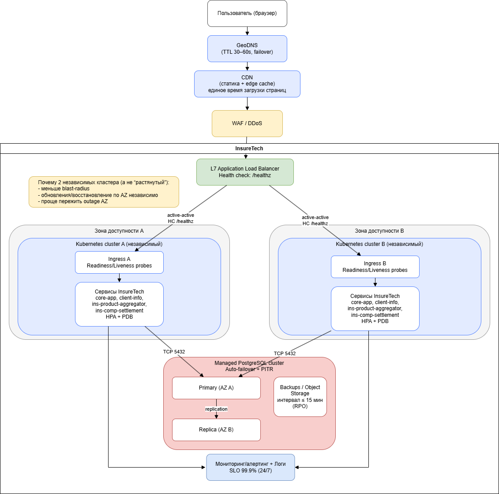

# ADR: Task1 — технологическая архитектура to-be (InsureTech)

## Контекст
- Требования: доступность 99,9%, RTO 45 мин, RPO 15 мин, 24/7, одинаковое время загрузки страниц для пользователей из разных регионов РФ.
- As-is: один Kubernetes-кластер в одной AZ и PostgreSQL master на отдельной ВМ (SPOF).

## Решения
### 1) Multi-AZ и отказоустойчивость
- Разворачиваем приложение в **2 зонах доступности** в режиме **active-active** для веб/API.
- Для снижения blast-radius используем **2 независимых Kubernetes-кластера** (по одному в каждой AZ).

### 2) Балансировка и health checks
- Входной контур: **GeoDNS → CDN → WAF/DDoS → L7 ALB**.
- **Health checks**:
  - ALB проверяет `/healthz` (Ingress/edge приложения).
  - В Kubernetes: readiness/liveness probes у сервисов.
- При деградации AZ: ALB исключает нездоровые backend’ы; GeoDNS может переключать endpoint при полной недоступности.

### 3) База данных (RTO/RPO)
- Используем **кластер PostgreSQL** с репликацией между AZ и **авто-failover** (managed-сервис или Patroni-подход).
- **RPO ≤ 15 мин** обеспечивается комбинацией репликации + **PITR/backup** с шагом ≤ 15 минут.
- **RTO ≤ 45 мин** достигается авто-failover БД и сохранением работоспособности веб/API во второй AZ.

### 4) Равномерное время загрузки по регионам РФ
- **CDN** для статики (JS/CSS/изображения) и опционально edge-cache для публичных read-only ответов.
- Это минимально-инвазивный способ “выровнять” UX без обязательного мульти-регионального бэкенда.

### 5) Шардирование
- На текущем объёме данных (**~50 GB**) шардирование **не требуется**.
- Закладываем возможность горизонтального роста за счёт репликации/кэшей/масштабирования сервисов; при кратном росте — пересмотр (партиционирование/шардинг по доменным ключам).

## Артефакты
- `Task1/InsureTech_технологическая_архитектура_as-is.drawio`
- `Task1/InsureTech_технологическая_архитектура_to-be.drawio`

